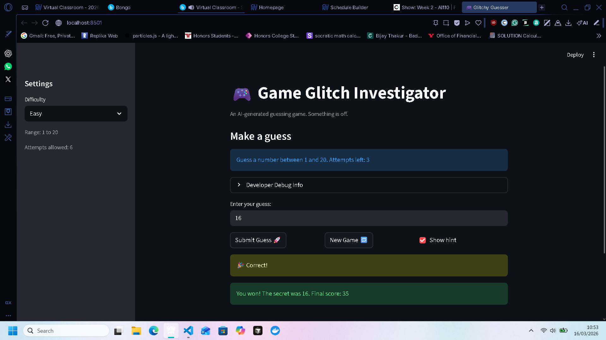

# 🎮 Game Glitch Investigator: The Impossible Guesser

## 🚨 The Situation

You asked an AI to build a simple "Number Guessing Game" using Streamlit.
It wrote the code, ran away, and now the game is unplayable.

- You can't win.
- The hints lie to you.
- The secret number seems to have commitment issues.

## 🛠️ Setup

1. Install dependencies: `pip install -r requirements.txt`
2. Run the broken app: `python -m streamlit run app.py`

## 🕵️‍♂️ Your Mission

1. **Play the game.** Open the "Developer Debug Info" tab in the app to see the secret number. Try to win.
2. **Find the State Bug.** Why does the secret number change every time you click "Submit"? Ask ChatGPT: *"How do I keep a variable from resetting in Streamlit when I click a button?"*
3. **Fix the Logic.** The hints ("Higher/Lower") are wrong. Fix them.
4. **Refactor & Test.** - Move the logic into `logic_utils.py`.
   - Run `pytest` in your terminal.
   - Keep fixing until all tests pass!

## 📝 Document Your Experience

### 🎯 Game Purpose
This is a number guessing game built with Streamlit. The player picks a difficulty (Easy, Normal, or Hard), which sets the number range and attempt limit. The game picks a secret number and the player tries to guess it within the allowed attempts. After each guess, the game gives a hint (Go Higher / Go Lower) to guide the player toward the correct answer. Points are awarded for winning, with a higher score for fewer attempts.

### 🐛 Bugs Found

1. **Reversed hint messages** — When the guess was too high, the game said "Go HIGHER!" and when too low, it said "Go LOWER!" — completely backwards.
2. **Hard difficulty easier than Normal** — Hard mode used range 1–50, which is a smaller range than Normal's 1–100. Hard should be harder, not easier.
3. **Hint text hardcoded to "1 and 100"** — The info banner always said "Guess a number between 1 and 100" regardless of the selected difficulty.
4. **Secret number not resetting on difficulty change** — Switching from Normal to Easy kept the old secret (e.g. 40), which was outside the Easy range of 1–20.
5. **New Game button incomplete reset** — Clicking "New Game" did not reset `status`, `score`, or `history`, so the old game state carried over.
6. **New Game ignored difficulty range** — The secret was always picked from `random.randint(1, 100)` instead of using the selected difficulty's range.
7. **String vs. integer comparison on even attempts** — Every even attempt converted the secret to a string, causing lexicographic comparison errors (e.g., `"9" > "50"` evaluates `True` as strings).
8. **Score rewarded wrong guesses** — `update_score` gave +5 points for a "Too High" outcome on even-numbered attempts, inconsistently rewarding incorrect guesses.

### 🔧 Fixes Applied

1. **Fixed hint directions** in `check_guess`: `guess > secret` now returns "Go LOWER!" and `guess < secret` returns "Go HIGHER!".
2. **Fixed Hard difficulty range** in `get_range_for_difficulty`: changed from `1, 50` to `1, 200`.
3. **Fixed dynamic hint text** in `app.py`: replaced hardcoded `"1 and 100"` with `f"{low} and {high}"`.
4. **Fixed difficulty-change reset** in `app.py`: added a check `st.session_state.get("difficulty") != difficulty` to regenerate the secret and reset state when difficulty changes.
5. **Fixed New Game full reset** in `app.py`: "New Game" now resets `secret`, `attempts`, `score`, `status`, and `history`.
6. **Fixed New Game range** in `app.py`: `random.randint(low, high)` now uses the difficulty-derived range.
7. **Removed string/int type-switching bug** in `app.py`: the secret is now always passed as an integer to `check_guess`, eliminating the broken lexicographic comparison.
8. **Fixed scoring for wrong guesses** in `update_score`: both "Too High" and "Too Low" now consistently deduct 5 points.
9. **Refactored core logic** into `logic_utils.py`: `get_range_for_difficulty`, `parse_guess`, `check_guess`, and `update_score` were moved out of `app.py` for cleaner separation and testability.

## 📸 Demo

- 

## 🚀 Stretch Features

- [ ] [If you choose to complete Challenge 4, insert a screenshot of your Enhanced Game UI here]
